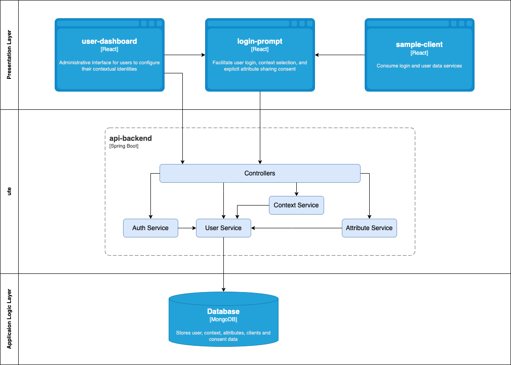
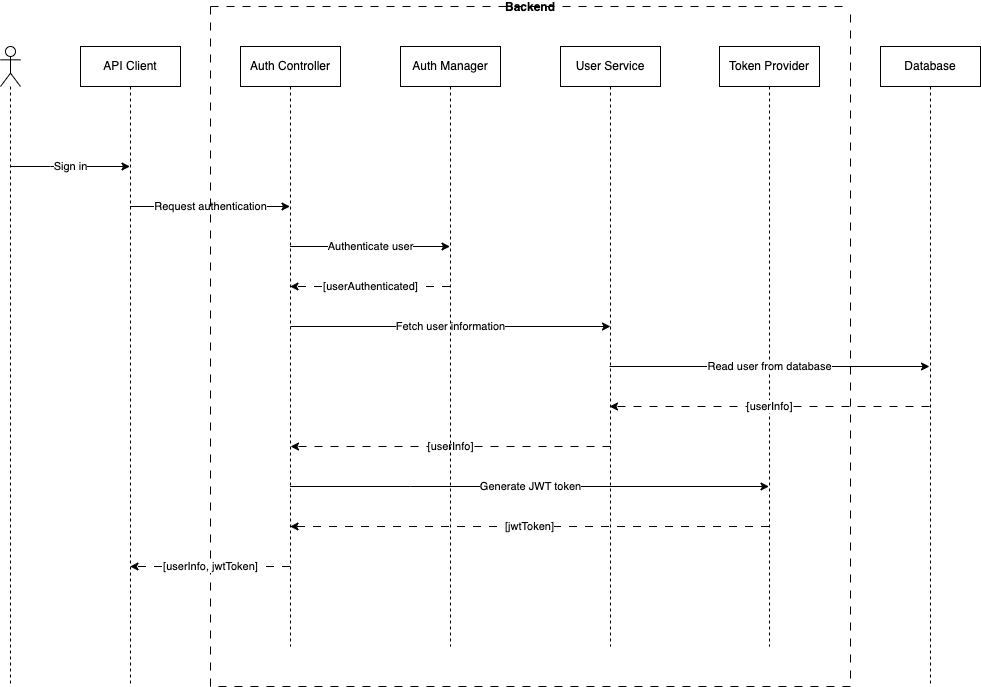
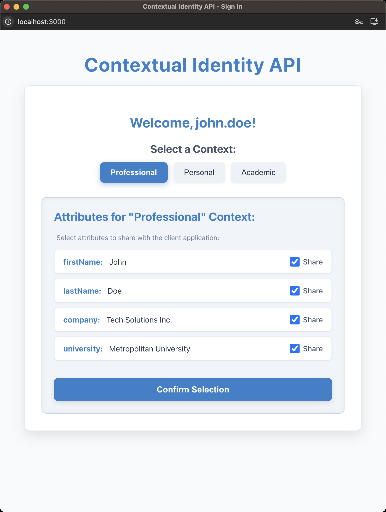
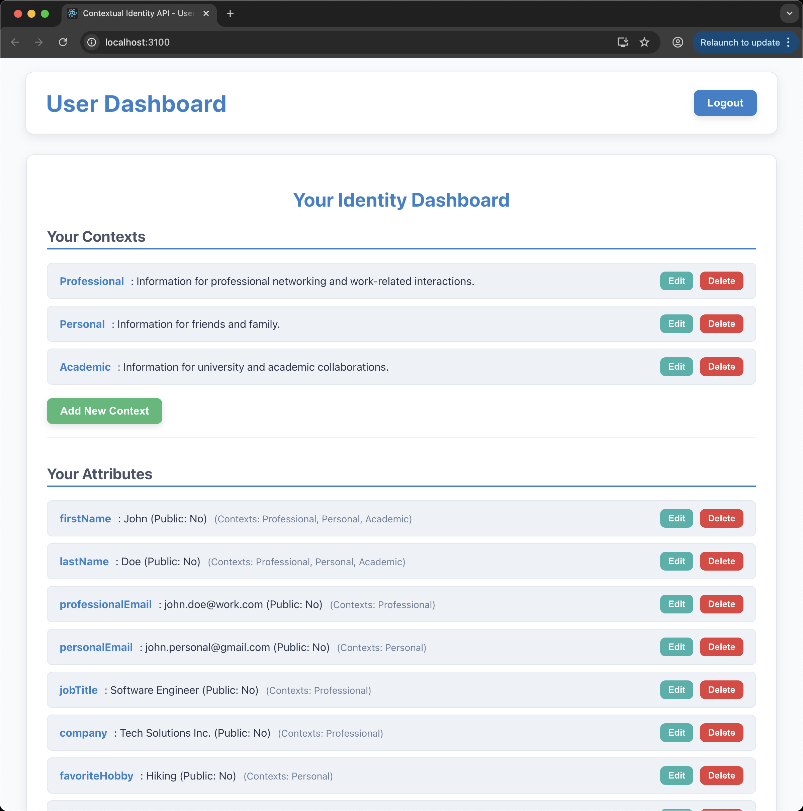

# Technical Write-Up: Sprint 1 Summary – Backend Refactoring & Attribute Sharing Enhancements

* **Project:** Contextual Identity API
* **Developer:** Antonio Simoes
* **Sprint Period:** Week 11 - Week 12
* **Date:** 28.06.2025

---

### Executive Summary

- Backend migrated from mock services to a MongoDB-based persistent store.
- Secure authentication implemented using JWT and Spring Security.
- Attribute-level user consent feature added during login.
- Backend modularized and covered by unit + integration tests.

---

## 1. Project Overview

* **Project Goal:** To create an API enabling users to manage their identity attributes and selectively share specific
  data sets (contexts) with different applications, enhancing user privacy.

* **Key Idea:** Provide granular control over personal data disclosure in various digital interactions.

* **Technologies:** Java (Spring Boot), React JS, MongoDB, Liquibase.

  

---

## 2. Sprint 1 Features and Objectives

* **Sprint Focus:** Transition the backend to a persistent MongoDB database and enhance the user's control over
  attribute sharing in the login process.

* **Key Achievements:**

    * **Refactored Backend Code:** Organized the backend code into vertical slices, improving modularity and
      maintainability.

    * **Backend Database Migration:** Switched from an in-memory mock data service to MongoDB for user, context, and
      attribute storage.

    * **Database Schema Management:** Implemented Liquibase with its MongoDB extension for controlled database
      initialization and data seeding.

    * **Model-Database Mapping:** Ensured Java models (`User`, `Context`, `IdentityAttribute`) correctly map to MongoDB
      documents, addressing specific deserialization challenges for embedded IDs.

    * **Secure JWT Authentication Implemented:** Established a robust, stateless token-based authentication system using
      JSON Web Tokens (JWTs) to secure API endpoints, enhancing application security and scalability.

    * **CORS Configuration:** Configured Cross-Origin Resource Sharing (CORS) policies to enable secure communication
      between the independent React frontend applications and the Spring Boot backend API.

    * **Enhanced User Attribute Sharing:** Implemented a feature in the `login-prompt` to allow users to selectively
      choose which `visible` attributes to share with the client application.

    * **Testing:** Added unit and integration tests for the `api-backend` to ensure functionality and reliability.

---

## 3. Key Technical Approaches

* **Spring Data MongoDB (Embedded Documents):**

    * Used Spring Data MongoDB to simplify interaction with MongoDB.

    * `User` objects are stored as top-level documents. `Context` and `IdentityAttribute` objects are embedded within
      the `User` document as lists.

    * The `@Field("id")` annotation was crucial for correctly mapping the `id` property for embedded `Context`
      and `IdentityAttribute` objects from MongoDB documents to Java objects. This resolved issues where these IDs were
      being read as `null`.

* **Liquibase for MongoDB Migrations:**

    * Employed Liquibase with the `liquibase-mongodb` extension to manage database changes and seed initial data.

    * An `initial-user-data.yaml` changelog was created to set up the `users` collection and insert initial `User`
      documents, including nested contexts and attributes.

    * A custom `MongoLiquibaseRunner` (`CommandLineRunner`) was added to ensure Liquibase executes reliably on
      application startup.

* **JWT-Based Authentication (Spring Security Integration):**

    * Integrated JWTs with Spring Security, configuring a custom `JwtAuthenticationFilter` to intercept, validate, and
      authenticate requests using tokens.

    * Employed `jjwt` library for secure JWT generation (HMAC-based signing) and robust token validation (expiration,
      signature integrity).

    * Configured stateless session management (`SessionCreationPolicy.STATELESS`) to support scalable, token-based
      authentication.

    * Implemented `AuthEntryPointJwt` for standardized unauthorized access responses (401 JSON errors) for API
      consumers.

  

* **Password Hashing with BCrypt:**

    * Incorporated `BCryptPasswordEncoder` for strong, one-way hashing of user passwords, significantly improving
      security against brute-force and rainbow table attacks.

    * Updated Liquibase changelogs to store pre-hashed passwords, ensuring data integrity and consistency with the new
      security requirements.

* **CORS Configuration for Frontend Integration:**

    * Enabled global CORS configuration in Spring Security to allow specific frontend
      origins (`http://localhost:3000`, `http://localhost:3100`, `http://localhost:3200`) to make cross-origin requests,
      including credentials and all headers.

    * This ensures seamless interaction between the React client applications and the backend API, resolving potential
      communication errors due to browser security policies.

* **Java `Optional` for Robustness:**

    * Utilized Java's `Optional` type to improve null-safety and functional code style in the `UserService`.

    * Specifically, `flatMap()` was used instead of `map()` in scenarios where the lambda expression itself returned
      an `Optional`, preventing nested `Optional` types and resolving compiler warnings.

* **Frontend Data Flow (`window.postMessage` & Filtering):**

    * The `login-prompt` (running at `http://localhost:3000`) uses `window.postMessage()` for secure cross-origin
      communication with other client applications (e.g., `user-dashboard` at `http://localhost:3100`).

    * The `ContextSelectionPage` now presents checkboxes for *visible* attributes within a selected context.

    * The user's selections are captured, and only the explicitly chosen attributes are sent back to the client
      application, providing fine-grained control over data disclosure.

---

## 4. Testing Strategy and Coverage

A comprehensive testing strategy has been implemented to ensure the reliability and correctness of the backend API. This
includes both unit tests for core business logic and integration tests for API endpoints and database interactions,
contributing to high code quality and confidence in the application's functionality.

### 4.1 Unit Testing

Unit tests focus on individual components in isolation, often using mocks to simulate dependencies.

### 4.2 Integration Testing

Integration tests validate the interaction between different components, including controllers, services, and the
database, by loading a more complete Spring application context.

### Overall Coverage

Through this combination of unit and integration tests, robust coverage has been achieved for the backend's core
functionalities, user data management, and security authentication mechanisms, significantly enhancing the reliability
and confidence in the API.

---

## 5. Illustrative Code Snippets

* **Liquibase Initial Data (`001-initial-user-data.yaml`):**

    ```yaml
    # Snippet demonstrating user insertion with nested contexts/attributes
    databaseChangeLog:
      - changeSet:
          id: 001-initial-user-data
          author: asimoes
          changes:
            - createCollection:
                collectionName: users
            - insertOne:
                collectionName: users
                document: |
                  {
                    "_id": "user123",
                    "username": "john.doe",
                    "password": "$2a$10$hif81LnTErGnkgIRACHP2eXzk0P2RYJDRjN/mZCOAc7PrEhEeC8wW",
                    "email": "john.doe@example.com",
                    "roles": ["ROLE_USER"],
                    "contexts": [
                      { "id": "ctx-prof", "name": "Professional", "description": "..." }
                    ],
                    "attributes": [
                      { "id": "attr-fn", "userId": "user123", "name": "firstName", "value": "John", "contextIds": ["ctx-prof"], "visible": true }
                    ]
                  }
            # ... (jane.smith user insert example) ...
    ```

This YAML defines how initial user data, including their nested contexts and attributes, is
populated into MongoDB using Liquibase's `insertOne` command. This ensures a consistent starting state for the
database.

* **`IdentityAttribute` Model with `@Field`:**

    ```java
    package com.simoes.contextual.model;

    import org.springframework.data.mongodb.core.mapping.Field; // Important import

    // ...
    public class IdentityAttribute {
      @Field("id") // Maps the MongoDB 'id' field to this Java property
      private String id;
      // ...
    }
    ```

The `@Field("id")` annotation explicitly tells Spring Data MongoDB to map the `id` field from the
MongoDB document (which is a standard field for nested objects, not MongoDB's special `_id`) to the `id` property
in our Java `IdentityAttribute` and `Context` objects. This was critical for correctly retrieving these IDs from
the database.

* **Frontend Selective Sharing Logic (`ContextSelectionPage.js`):**

    ```javascript
    // ...

    const handleShareCheckboxChange = (attributeId) => {
        setSharedAttributeIds((prevSelected) => {
            // Toggles attribute selection for sharing
            return prevSelected.includes(attributeId)
                   ? prevSelected.filter((id) => id !== attributeId)
                   : [...prevSelected, attributeId];
        });
    };

    const handleConfirmSelection = () => {
        if (selectedContext && onContextSelectionComplete) {
            // Filters attributes based on user's checkbox selections
            const attributesToShare = attributes.filter(attr => sharedAttributeIds.includes(attr.id));
            onContextSelectionComplete({
                // ...
                contextualAttributes: attributesToShare // Only send selected attributes
            });
        }
        // ...
    };
    ```

This JavaScript logic from the `login-prompt`'s context selection page enables dynamic attribute
filtering. Users can check/uncheck attributes presented to them. The `handleConfirmSelection` function then
filters the list of attributes to be shared, sending only those explicitly selected by the user back to the
requesting client application.

---

## 6. Visual Representation

* **Figure 1: Login Prompt - Attribute Selection for Sharing**

  

  **Description:** This screenshot demonstrates the `login-prompt`'s updated interface. After selecting a context, users
  are presented with a list of available (visible) attributes, each with a checkbox. This allows them to precisely
  control which specific attributes will be disclosed to the external application.

* **Figure 2: User Dashboard - Data Persistence via MongoDB**

  

  **Description:** This image confirms the successful integration of MongoDB. The `user-dashboard` now loads and
  persists all contexts and attributes directly from the database. Any modifications (add, edit, delete) made here will
  remain saved even after the backend application restarts.

---

## 7. Sprint 1 Retrospective

* **Successes:**

    * Successfully migrated core data to MongoDB, established reliable Liquibase-based schema management, and
      significantly enhanced user control over attribute sharing in the `login-prompt`. The transition to a persistent
      backend marks a major milestone.

    * Refactored initial backend prototype code into vertical slices, which significantly improves encapsulation,
      modularity, and maintainability

    * Provided almost complete test coverage for the backend, ensuring high reliability and confidence in the API's
      functionality.

* **Challenges & Solutions:**

    * **Liquibase Setup:** Initial issues with MongoDB-specific Liquibase syntax were resolved by adhering
      to `insertOne` and proper YAML formatting.

    * **Embedded Document ID Mapping:** The most persistent issue was `id` fields of embedded objects (contexts,
      attributes) appearing `null` in Java. This was fixed by adding `@Field("id")` annotations to the respective model
      properties, explicitly guiding Spring Data MongoDB's deserialization.

    * **JWT Token Handling & Authentication Flow:** Successfully implemented JWT-based authentication in the backend,
      transitioning the API to a stateless security model. Initial authentication failures were traced to missing **or
      incorrect** client-side JWT transmission, which **was subsequently addressed for the `user-dashboard` application
      during debugging sessions in this sprint.**

    * **CORS Configuration:** Encountered and resolved Cross-Origin Resource Sharing issues when integrating the React
      frontend with the Spring Boot backend, ensuring secure cross-origin communication for API requests.

    * **Implement Client-Side JWT Integration:** Develop client-side logic in React applications to capture JWTs upon
      login and include them in subsequent authenticated API requests. This enabled full end-to-end authentication
      flow.

* **Next Steps (Sprint 2 Focus):**

    * Merge the `login-prompt` and `user-dashboard` applications into a single React application for a unified user
      experience.
    
    * Refactor UI modules for better structure and maintainability, ensuring a clear separation of concerns.

    * Introduce a component library for reusable UI elements, enhancing consistency across the application.

    * Replace native `window.confirm` dialogs with custom modal components in `user-dashboard` for improved user
      experience.

    * Enhance frontend form validation for better data integrity.

    * Implement unit tests for critical frontend components to ensure reliability.

    * Introduce state management (e.g., Zustand, Redux) to simplify cross-component logic".

    * Develop a user registration feature.

